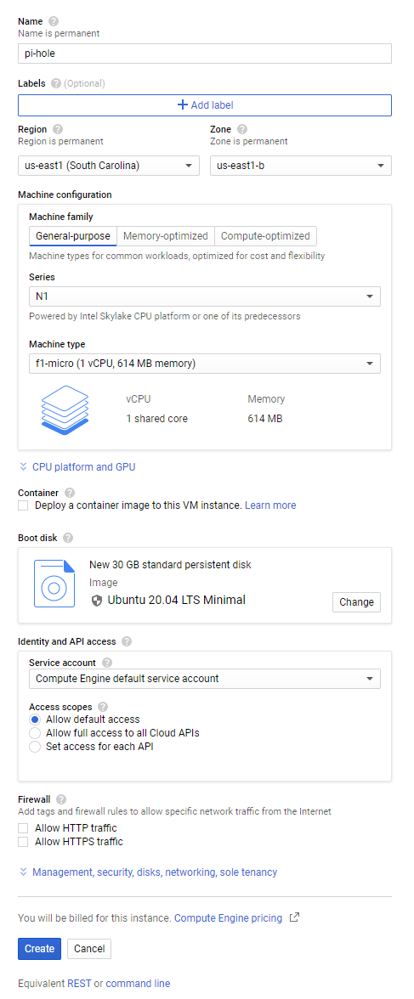

# Server Provisioning with Google Cloud

# Google Cloud Login and Account Creation

Go to https://cloud.google.com and click **Console** at the top right if you have previously used Google's Cloud Services, or click **Try Free** if it's your first time.

### Account Creation
- **Step 1 of 2**   Agree to the terms and continue.  
- **Step 2 of 2**   Set up a payments profile and continue  
### Project & Compute Engine Creation
1. Click the Hamburger Menu at the top left:  
2. Click **Compute Engine**:  
3. Select **VM instances**:  
4. Create a Project if you don't already have one:  
5. Enable billing for this Project if you haven't already:  
- Compute Engine will begin initializing:  

# Compute Engine Virtual Machine Setup

1. Create a Virtual Machine instance on Compute Engine:  
2. Customize the instance:  
3. Name your Virtual Machine **pi-hole**.  To qualify for the Free Tier, your Region selection should be any US region only (excluding Northern Virginia [us-east4]). I have used **us-east1** and the **us-east1-b** zone because it is closest to me.  Choose the **f1-micro** Machine Type in the dropdown.  You must **Change** the operating system to **Ubuntu** (Operating System dropdown menu), and choose **Ubuntu 20.04 LTS Minimal** (version dropdown menu).  Change the Boot Disk Size to be **30GB** if you plan on keeping your DNS lookup records for any reason, otherwise the default **10GB** disk allocation is adequate.
 
4. Expand **Management, Security, disks, networking, sole tenancy** and click the **Networking** tab. Click the Pencil icon under **Network Interfaces**.  
5. The External IP Address should not be Ephemeral. Choose **Create IP Address** to Reserve a New Static IP Address    
6. You can log into your Virtual Machine via SSH in a Browser by clicking the SSH button. Make note of your External IP (it will be different from the screenshot below). 
7. Click the Hamburger Menu at the top left, click **VPC Network** and click **Firewall Rules**.    Click **Create Firewall Rule** at the top center of the page. The name of your rule should be `allow-wireguard`, change the **Targets** dropdown to **All instances in the network**. The **Source IP Ranges** should be `0.0.0.0/0`. The **udp** checkbox should be selected, and the port number next to it should be changed from `all` to `51515`. Then click the **Create** button. You can disable the `default-allow-rdp` rule which Google set up with a default action of Allow, but because our server does not run any service on Port 3389 it is harmless to leave this rule alone. Do not disable the **default-allow-ssh** firewall rule, or you will disable the browser-based SSH from within the Google Cloud Console.

# Cloud Console Mobile App

Install the "Cloud Console" app on your Android or iOS device.

Manage and monitor Google Cloud Platform services from your Android or iOS device.